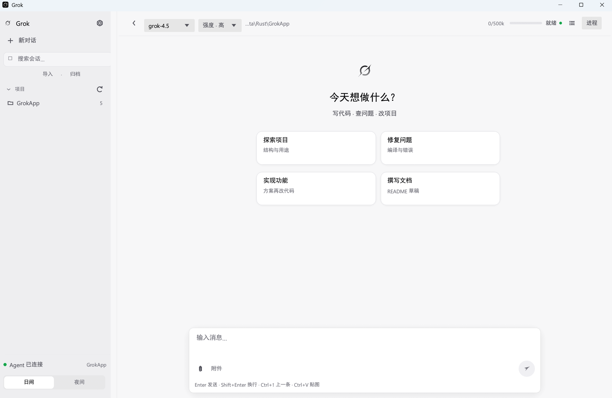
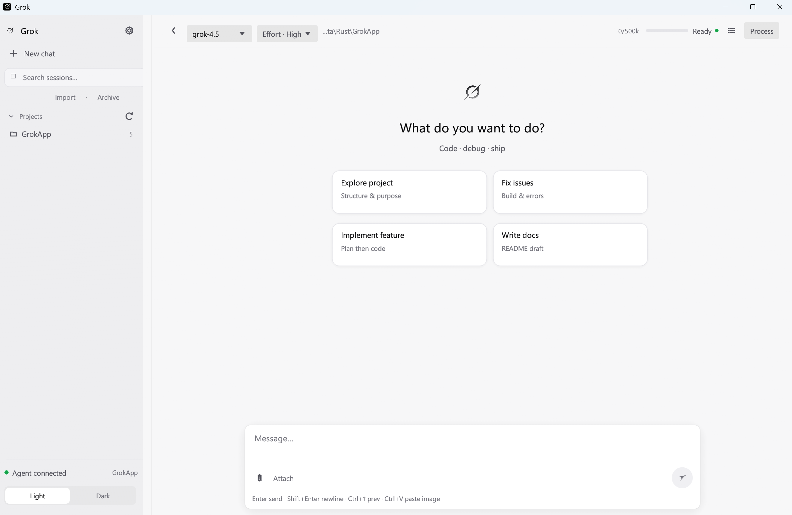

# Grok App / Grok Desktop（中文）

**非官方**桌面客户端：基于官方 [Grok Build CLI](https://github.com/xai-org/grok-build) 的 `grok agent stdio`（ACP）。

> 与 xAI 无隶属关系。「Grok」为 xAI 商标。

英文主文档：[README.md](../../README.md)

| | |
|--|--|
| 仓库 | [qingchencloud/grok-app](https://github.com/qingchencloud/grok-app)（**已公开**） |
| **下载安装包** | **[Releases](https://github.com/qingchencloud/grok-app/releases)** |
| 发版说明 | [docs/RELEASE.md](../RELEASE.md) |
| 配置项 | [docs/CONFIGURATION.md](../CONFIGURATION.md) |
| 勿上传内容 | [docs/REPO_HYGIENE.md](../REPO_HYGIENE.md) |
| 界面语言 | 设置 → 外观 → Language（English / 中文） |
| **产品官网** | https://qingchencloud.github.io/grok-app/ （本仓库 `preview/`） |

## 界面截图

<p align="center">
  
</p>

<p align="center">
  <em>中文 · 日间模式 · 空会话与快捷入口</em>
</p>

<p align="center">
  
</p>

<p align="center">
  <em>English · light mode · empty chat</em>
</p>

截图目录：[`docs/screenshots/`](../screenshots/)

## 下载客户端（重要）

1. 打开 **[Releases](https://github.com/qingchencloud/grok-app/releases)**  
2. 选择版本  
3. **Windows 推荐：** 下载  
   **`GrokDesktop-Setup-<版本>-windows-x64.exe`**  
   → **双击即可安装**（不需要压缩包、不用解压）  
4. **便携版（可选）：** `GrokDesktop-<版本>-windows-x64.exe` 单文件直接运行  
5. **macOS：** `GrokDesktop-<版本>-macos-*` 单文件  
6. 本机仍需 Grok CLI 并登录：

```powershell
# Windows
irm https://x.ai/cli/install.ps1 | iex
grok login
```

```bash
# macOS
curl -fsSL https://x.ai/cli/install.sh | bash
grok login
```

## 如何打指定版本包（维护者）

```bash
# 推荐：打 tag 触发 CI 自动打包并上传到 Releases
git tag v0.1.0
git push origin v0.1.0
```

或在 GitHub：**Actions → Release → Run workflow**，填写版本号 `0.1.0`。

详见 [RELEASE.md](../RELEASE.md)。

## 功能

- Agent 连接、流式对话、思考/工具/计划  
- 会话索引（与 CLI 隔离，可导入 CLI 会话）  
- 模型 / 工作目录 / 权限 / 图片附件  
- 设置映射 `~/.grok/config.toml`  
- 中英文界面切换  

## 从源码构建

```bash
git clone https://github.com/qingchencloud/grok-app.git
cd grok-app
cargo run --bin GrokDesktop
cargo test --test core_logic
```

Windows 打包：`.\packaging\build-release.ps1`

## 配置与隐私

- 桌面配置：`%APPDATA%\GrokApp\config.json`（不进 Git）  
- 登录态：`~/.grok/auth.json`（不进 Git）  
- 默认模型等产品常量见 [CONFIGURATION.md](../CONFIGURATION.md)  
- **禁止上传**：`target/`、`dist/`、`vendor/`、密钥、本机会话目录 — 见 [REPO_HYGIENE.md](../REPO_HYGIENE.md)

## 许可证

MIT — 见 [LICENSE](../../LICENSE)。
